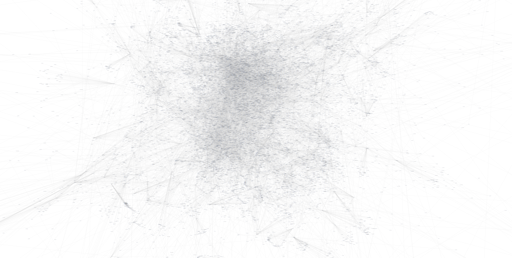
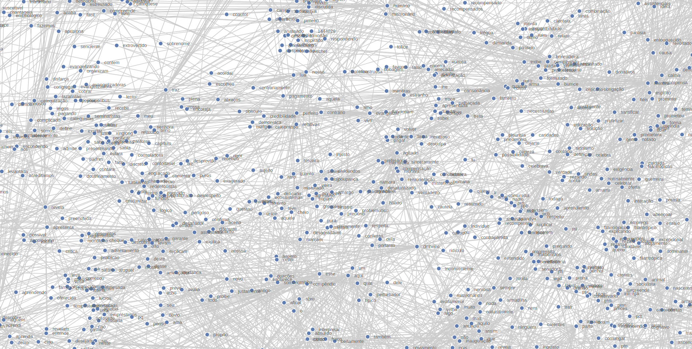

# NLP Neural Language Processing (Experiment Results in D3.js)

In this projetc I show a result of a experiment with Wikipedia data, processing [word2vec](https://deeplearning4j.org/docs/latest/deeplearning4j-nlp-word2vec). This code show a result with D3.js from [code](http://bl.ocks.org/eyaler/10586116).

## Authors

* **[Maria Luísa Costa Pinto]** - (http://dcc.ufmg.br/~maria.luisa)
